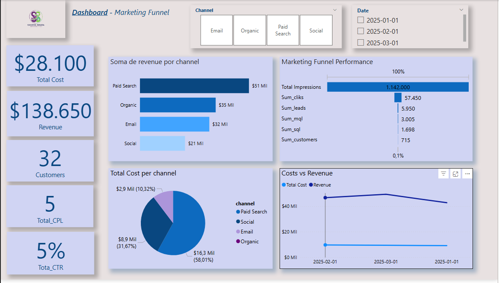

# Marketing Funnel Performance Dashboard

## 📖 Overview

This project involves the end-to-end development of a marketing performance dashboard. The primary goal was to analyze a raw marketing CSV file, process it using Python for data cleaning and feature engineering, and then build an interactive dashboard in Power BI to visualize key metrics (KPIs) and drive business insights.

## 🛠️ Tools Used

* **Python (Pandas):** For data cleaning, transformation, and feature engineering.
* **Power BI:** For data modeling (Star Schema with a Date Dimension) and visualization.
* **DAX:** For creating advanced measures like `Total CPL` and `Total CTR`.

## 💻 The Process

### 1. Data Cleaning & Transformation (Python)

The original `marketing_funnel.csv` file presented significant challenges:
* The data was not properly delimited and was read as a single column.
* Numeric values used dots (`.`) as decimal separators, which caused import errors in Power BI due to regional settings (expecting commas `,`).
* Core KPIs like CTR, CPC, and CPL were missing.

To solve this, a Python script (`/scripts/process_data.py`) was developed using the Pandas library to:
1.  **Load and Split:** Correctly parse the CSV data by splitting the rows and headers.
2.  **Type Conversion:** Ensure all numeric columns were correctly converted to numeric types.
3.  **Feature Engineering:** Create new columns for key metrics:
    * `cpc` (Cost Per Click)
    * `ctr` (Click-Through Rate)
    * `cpl` (Cost Per Lead)
    * `conversion_rate`
4.  **Export:** Save the cleaned and enriched data to a new file, `marketing_funnel_analyzed.csv`, ready for Power BI.

### 2. Data Modeling & Visualization (Power BI)

In Power BI:
* A **Star Schema** model was implemented by connecting the main `marketing_funnel_analyzed` (Fact Table) to a custom-built `dCalendario` (Dimension Table).
* Professional **DAX measures** were written to calculate business-critical KPIs like `Total CPL` and `Total CTR`, ensuring calculations were accurate (e.g., `SUM(Cost) / SUM(Leads)`) rather than just averaging row-level data.
* The final dashboard provides a clear overview of total costs, revenue, and key performance indicators, with breakdowns by channel and trends over time.

## 📊 Key Insights

* **Total Revenue** ($139k) significantly outweighs **Total Cost** ($28.8k), showing a positive ROI.
* The **"Paid Search"** channel is the largest driver of both revenue and cost, as seen in the "Total Revenue by Channel" and "Total Cost by Channel" visuals.
* The **Conversion Funnel** visual clearly identifies the drop-off rates between each stage, from `Impressions` down to `Customers`.

